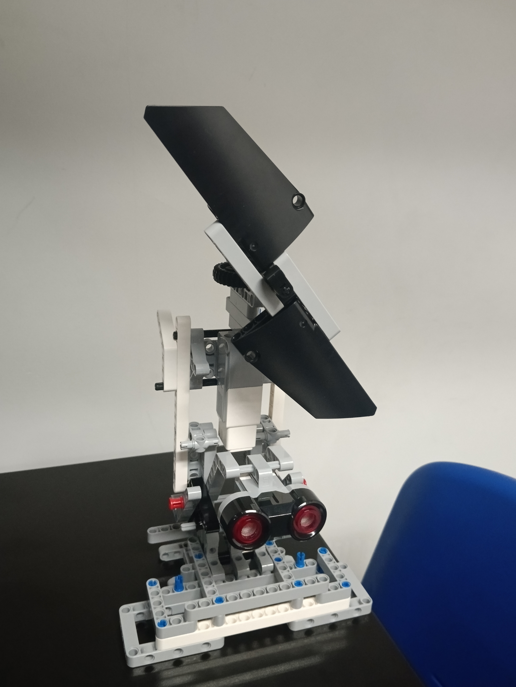

# Projeto - Robótica
Projeto da Faculdade Impacta, curso de Engenharia da Computação, disciplina de Robótica, lecionada pelo professor Gustavo Molina Figueiredo, utilizando o kit de robótica Lego Mindstorms EV3.

### Integrantes
Adriano Paula de Araujo - 2200305  
Lucas Eduardo Salles de Souza - 2100844 
Raphael Alario - 2202061 
Tiago Pinheiro Bezerra - 2200533 
Victor Santini de Brito - 2200410 
Welvis Souza de Assis - 2101828  
Willian Lyu Tomimatsu - 2200019 

## Catavento

Desenvolvimento de um catavento que ativa e desativa automaticamente, além de aumentar sua velocidade baseado na distância entre o usuário/objeto e um sensor ultrassônico.

## Funcionamento

O catavento movimenta suas hélices em movimento rotacional, pela força de um motor que altera sua intensidade de acordo com um sensor ultrassônico, que detecta a distância de algum objeto até uma distância máxima de 30 cm. A cada 1 cm de distância o motor acelera em 10 graus por segundo.

https://github.com/user-attachments/assets/1274a455-a80a-4476-8ac5-c562d06b8332

[Vídeo do protótipo em funcionamento](https://youtube.com/shorts/uAiHR_ebFCE?feature=share)

## Desenvolvimento

Código escrito em Python 3 utilizando Micropython EV3 e a biblioteca do EV3.

